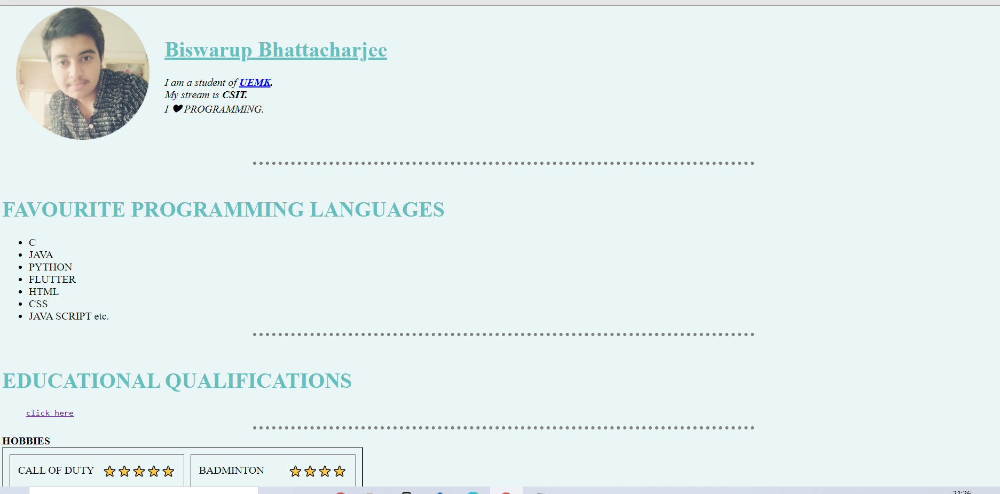

# DEMO-PROFILE-PG-BASIC :star_struck: :blush: :sunglasses: :computer:

[](https://shields.io/) [](https://shields.io/) 

***This new WebPage named 'Demo-Profile-Page' is created by Biswarup Bhattacharjee, student of BTECH, in University of Engineering and Management, Kolkata.***

**Email Id: bbiswa471@gmail.com.** 

**Contact No: 916290272740.** 

[](https://www.facebook.com/biswarup.bhattacharjee.5811) [](https://github.com/biswa2210)

## About :point_down: 

<div align="justified">
      
I am a student of BTECH in UEMK. My favourite programmimg languages are C, JAVA, PYTHON, FLUTTER, HTML, CSS, JAVA SCRIPT etc. My educational qualifications are secondary exam passout in 2017, HS passout in 2019, BTECH in 2023. My hobbies are programming, singing, playing Call of Duty and Badminton. This simple demo profile page shows all tese information about me.
</div>

## LINK of full project: :point_right: https://biswa2210.github.io/demo-profile-pg-basic/

## Purpose :point_down:

I have made this so that people can know about me. 

## Importance :point_down:

It is important for more interaction with people.

## Folder Structure :point_down:

```bash
demo-profile-pg-basic
      ├── css
      |    └── style.css
      ├── images
      |    └── dp.png
      ├── contactme.html
      ├── equali.html
      └── index.html

```                    
## Making :point_down:

I have made this using HTML5, CSS3.

## Screenshots :point_down: 

<div align="center">
<a href="pg.PNG"></a>
</div>

